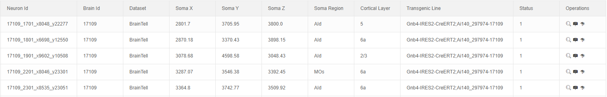
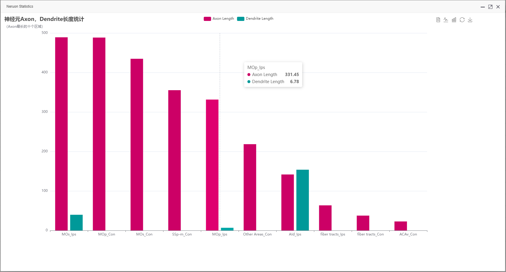
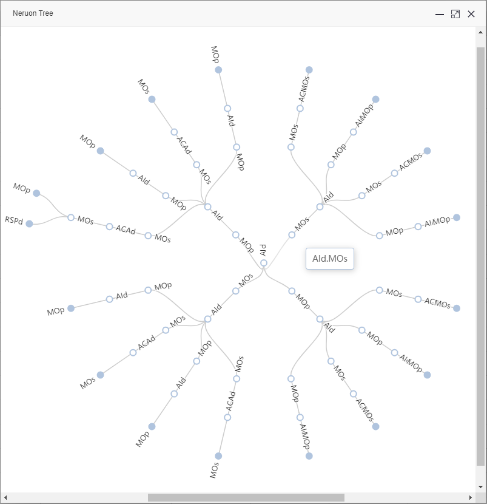
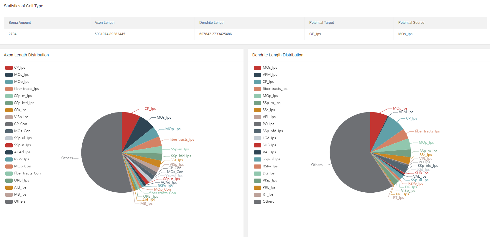
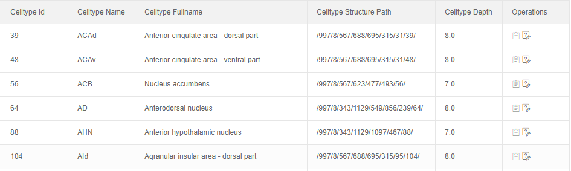
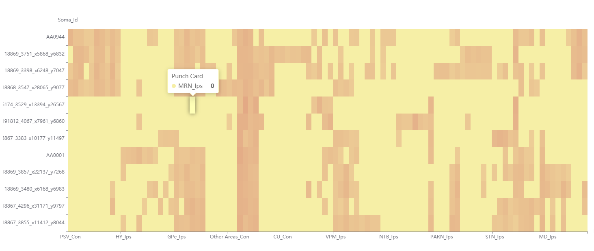
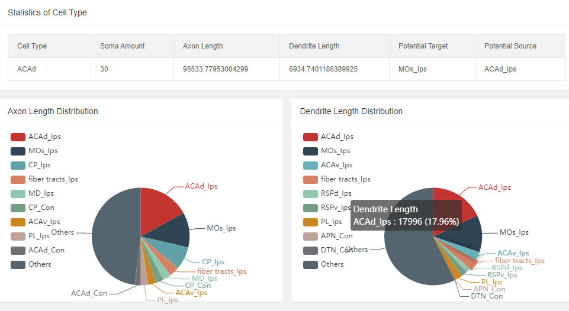
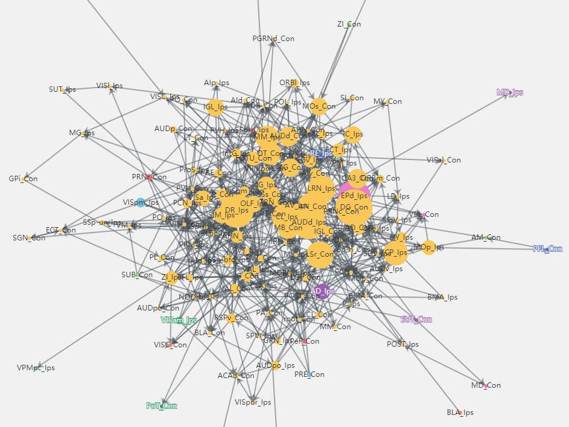
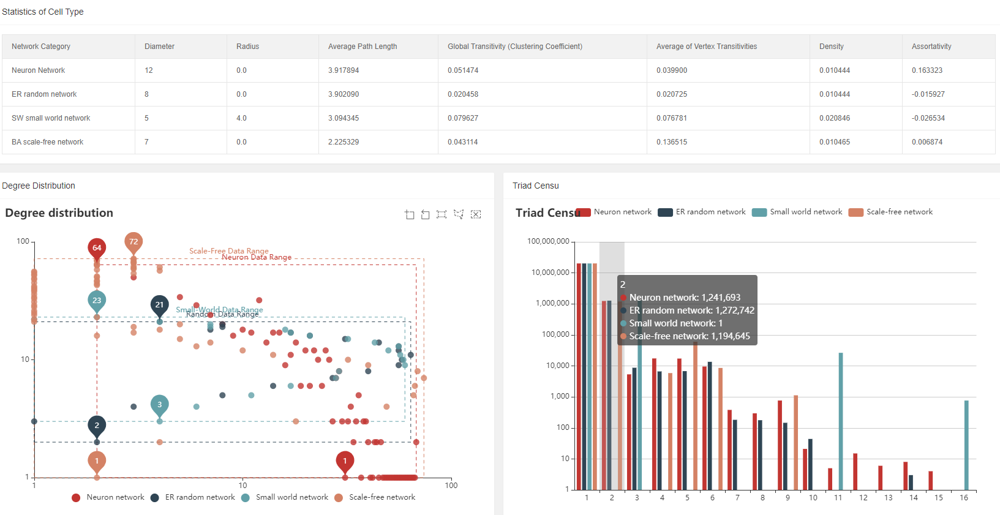

#  脑网络分析可视化系统
为了毕设要求，按照脑网络分析的过程做了一个可视化的系统。  
比较尴尬的地方是，受时间所限（而且对我研究没啥用啊），没有做交互，用户无法自己上传数据进行分析。  
可视化都是用Echarts做的，这玩意是真的强  

## 技术架构
- 基于Flask框架
- 前端：HTML+CSS+JS 
- 数据库：SQLAlchemy+MySQL(orm封装)
- 版本控制：Git
- 可视化图表：Echarts, Layui, x-admin模板

## 效果演示
[完整功能演示录屏](https://github.com/Mr-strlen/Mouse_Brain_Network_Analysis/blob/master/FlaskWeb/images/vedio%20record.mp4)
- 所有神经元基本信息
  
- 单个神经元形态
  
- 单个神经元统计信息
  
- 单个神经元投射路径
  
- 所有神经元统计结果
  
- 所有细胞类型基本信息
  
- 单个细胞类型内神经元轴突分布热力图
  
- 单个细胞类型的统计结果
  
- 脑网络可视化
  
- 网络分析结果
  

## 数据
使用单细胞形态重构数据，一部分来自Janelia Campus在19年发布的1000个神经元数据[1]，另一部分来自Allen Center发布的1708个神经元数据[2]。    
[1] Winnubst J, Bas E, Ferreira T A, et al. Reconstruction of 1,000 projection neurons reveals new cell types and organization of long-range connectivity in the mouse brain[J]. Cell, 2019, 179(1):268-281.   
[2] Wang Y, Xie P, Gong H, et al. Complete single neuron reconstruction reveals morphological diversity in molecularly defined claustral and cortical neuron types[J]. BioRxiv, 2019:675280.

## 其他
感谢Linus，谢芃老师在系统开发中作为模拟甲方提供的需求意见；  
感谢熊峰学长对神经元数据库和神经元投射路径相关知识的介绍；  
感谢王博学长和赵作翰同学在前端开发上的指导。
